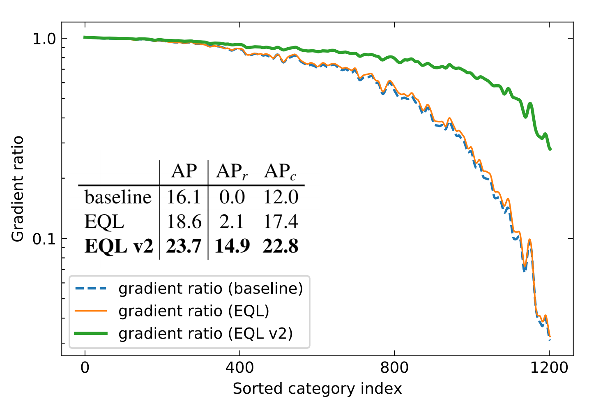

# The Equalization Losses for Long-tailed Object Detection and Instance Segmentation

This repo is official implementation CVPR 2021 paper: **Equalization Loss v2: A New Gradient Balance Approach for Long-tailed Object Detection** and CVPR 2020 paper: **Equalization loss for long-tailed object recognition**


<div></img></div>

Besides the equalization losses, this repo also includes some other algorithms:

- BAGS (Balance GroupSoftmax)
- cRT (classifier re-training)
- LWS (Learnable Weight Scaling)
## Requirements

- python 3.6+
- pytorch 1.5.0
- torchvision 0.6.0
- [mmdet 2.3](https://github.com/open-mmlab/mmdetection/tree/v2.3.0)
- [mmcv 1.0.5](https://github.com/open-mmlab/mmcv/tree/v1.0.5)

We test our codes on MMDetection V2.3, other versions should also be ok.

## Prepare LVIS Dataset

***for images***

LVIS uses same images as COCO's, so you need to donwload COCO dataset at folder ($COCO), and link those `train`, `val` under folder `lvis`($LVIS).

```
mkdir -p data/lvis
ln -s $COCO/train $LVIS
ln -s $COCO/val $LVIS
ln -s $COCO/test $LVIS
```
***for annotations***

Download the annotations from [lvis webset](https://lvisdataset.org/)

```
cd $LVIS
mkdir annotations
```
then places the annotations at folder ($LVIS/annotations)

Finally you will have the file structure like below:

    data
      ├── lvis
      |   ├── annotations
      │   │   │   ├── lvis_v1_val.json
      │   │   │   ├── lvis_v1_train.json
      │   ├── train2017
      │   │   ├── 000000004134.png
      │   │   ├── 000000031817.png
      │   │   ├── ......
      │   ├── val2017
      │   ├── test2017

***for API***

The official lvis-api and mmlvis can lead to some bugs of multiprocess. See [issue](https://github.com/open-mmlab/mmdetection/issues/4112)

So you can install this LVIS API from my modified repo.
```
pip install git+https://github.com/tztztztztz/lvis-api.git
```

## Testing with pretrain_models
```bash
# ./tools/dist_test.sh ${CONFIG} ${CHECKPOINT} ${GPU_NUM} [--out ${RESULT_FILE}] [--eval ${EVAL_METRICS}]
./tools/dist_test.sh configs/eqlv2/eql_r50_8x2_1x.py data/pretrain_models/eql_r50_8x2_1x.pth 8 --out results.pkl --eval bbox segm
```


## Training

```bash
# ./tools/dist_train.sh ${CONFIG} ${GPU_NUM}
./tools/dist_train.sh ./configs/end2end/eql_r50_8x2_1x.py 8 
```

Once you finished the training, you will get the evaluation metric like this:

**bbox AP**
```
 Average Precision  (AP) @[ IoU=0.50:0.95 | area=   all | maxDets=300 catIds=all] = 0.242
 Average Precision  (AP) @[ IoU=0.50      | area=   all | maxDets=300 catIds=all] = 0.401
 Average Precision  (AP) @[ IoU=0.75      | area=   all | maxDets=300 catIds=all] = 0.254
 Average Precision  (AP) @[ IoU=0.50:0.95 | area=     s | maxDets=300 catIds=all] = 0.181
 Average Precision  (AP) @[ IoU=0.50:0.95 | area=     m | maxDets=300 catIds=all] = 0.317
 Average Precision  (AP) @[ IoU=0.50:0.95 | area=     l | maxDets=300 catIds=all] = 0.367
 Average Precision  (AP) @[ IoU=0.50:0.95 | area=   all | maxDets=300 catIds=  r] = 0.135
 Average Precision  (AP) @[ IoU=0.50:0.95 | area=   all | maxDets=300 catIds=  c] = 0.225
 Average Precision  (AP) @[ IoU=0.50:0.95 | area=   all | maxDets=300 catIds=  f] = 0.308
 Average Recall     (AR) @[ IoU=0.50:0.95 | area=   all | maxDets=300 catIds=all] = 0.331
 Average Recall     (AR) @[ IoU=0.50:0.95 | area=     s | maxDets=300 catIds=all] = 0.223
 Average Recall     (AR) @[ IoU=0.50:0.95 | area=     m | maxDets=300 catIds=all] = 0.417
 Average Recall     (AR) @[ IoU=0.50:0.95 | area=     l | maxDets=300 catIds=all] = 0.497
 Average Recall     (AR) @[ IoU=0.50:0.95 | area=   all | maxDets=300 catIds=  r] = 0.197
 Average Recall     (AR) @[ IoU=0.50:0.95 | area=   all | maxDets=300 catIds=  c] = 0.308
 Average Recall     (AR) @[ IoU=0.50:0.95 | area=   all | maxDets=300 catIds=  f] = 0.415
```
**mask AP**
```
 Average Precision  (AP) @[ IoU=0.50:0.95 | area=   all | maxDets=300 catIds=all] = 0.237
 Average Precision  (AP) @[ IoU=0.50      | area=   all | maxDets=300 catIds=all] = 0.372
 Average Precision  (AP) @[ IoU=0.75      | area=   all | maxDets=300 catIds=all] = 0.251
 Average Precision  (AP) @[ IoU=0.50:0.95 | area=     s | maxDets=300 catIds=all] = 0.169
 Average Precision  (AP) @[ IoU=0.50:0.95 | area=     m | maxDets=300 catIds=all] = 0.316
 Average Precision  (AP) @[ IoU=0.50:0.95 | area=     l | maxDets=300 catIds=all] = 0.370
 Average Precision  (AP) @[ IoU=0.50:0.95 | area=   all | maxDets=300 catIds=  r] = 0.149
 Average Precision  (AP) @[ IoU=0.50:0.95 | area=   all | maxDets=300 catIds=  c] = 0.228
 Average Precision  (AP) @[ IoU=0.50:0.95 | area=   all | maxDets=300 catIds=  f] = 0.286
 Average Recall     (AR) @[ IoU=0.50:0.95 | area=   all | maxDets=300 catIds=all] = 0.326
 Average Recall     (AR) @[ IoU=0.50:0.95 | area=     s | maxDets=300 catIds=all] = 0.210
 Average Recall     (AR) @[ IoU=0.50:0.95 | area=     m | maxDets=300 catIds=all] = 0.415
 Average Recall     (AR) @[ IoU=0.50:0.95 | area=     l | maxDets=300 catIds=all] = 0.495
 Average Recall     (AR) @[ IoU=0.50:0.95 | area=   all | maxDets=300 catIds=  r] = 0.213
 Average Recall     (AR) @[ IoU=0.50:0.95 | area=   all | maxDets=300 catIds=  c] = 0.313
 Average Recall     (AR) @[ IoU=0.50:0.95 | area=   all | maxDets=300 catIds=  f] = 0.389
```

We place ours configs file in `./configs/`

- `./configs/end2end`: eqlv2 and other end2end methods
- `./configs/decouple`  decoupled-based methods

### How to train decouple training methods.

1. Train the baseline model (or EQL v2).
2. Prepare the pretrained checkpoint

```bash
  # suppose you've trained baseline model
  cd r50_1x
  python ../tools/ckpt_surgery.py --ckpt-path epoch_12.pth --method remove
  # if you want to train LWS, you should choose method 'reset'
```
3. Start training with configs

```bash
  # ./tools/dist_train.sh ./configs/decouple/bags_r50_8x2_1x.py 8
  # ./tools/dist_train.sh ./configs/decouple/lws_r50_8x2_1x.py 8
  ./tools/dist_train.sh ./configs/decouple/crt_r50_8x2_1x.py 8
```

## Pretrained Models on LVIS


| Methods| end2end | AP | APr  | APc | APf| pretrained_model|
| ------ |:---:|:---:|:-----:|:---:|:---:|:----:|
| Baseline | √ |16.1 | 0.0 | 12.0 | 27.4 | [model](https://drive.google.com/file/d/1DMK5wHtq1tjOkvuu917JWE5M5kem7lJe/view?usp=sharing)|
| EQL      | √ |18.6 | 2.1 | 17.4 | 27.2 | [model](https://drive.google.com/file/d/18azKn5GkeqnZGbqdLvv25ZS-Xbg_afOZ/view?usp=sharing)|
| RFS | √  |22.2 | 11.5 | 21.2 | 28.0 | [model](https://drive.google.com/file/d/1dbD-oovvyqWArg9FrpqQ841JJXPMZblw/view?usp=sharing) |
| LWS | × |17.0   |  2.0 | 13.5 | 27.4 | [model](https://drive.google.com/file/d/1CbsOgGr_gJMqqWCW-h8utcm8PeNGjqr7/view?usp=sharing)|
| cRT |  × |22.1 | 11.9  | 20.2 | **29.0** | [model](https://drive.google.com/file/d/1XsTBp2MkDKnvkvYOJloJakArCcF_DPgn/view?usp=sharing)|
| BAGS | × |23.1 | 13.1 | 22.5 | 28.2 | [model](https://drive.google.com/file/d/1kr3ObT_Vh3YKOjHxjGj7prJ_B_zA7m8s/view?usp=sharing)|
| EQLv2 | √ |**23.7** | **14.9**  | **22.8** | 28.6 | [model](https://drive.google.com/file/d/1kCTRSI9CrUSEtSd9IB00rbLrLteoR_4B/view?usp=sharing) |

## How to train EQLv2 on OpenImages

### 1. Download the data

Download openimages v5 images from [link](https://storage.googleapis.com/openimages/web/download_v5.html), The folder will be 

```
openimages
    ├── train
    ├── validation
    ├── test

```

Download the annotations for Challenge 2019 from [link](https://storage.googleapis.com/openimages/web/challenge2019_downloads.html), The folder will be 
```
annotations
    ├── challenge-2019-classes-description-500.csv
    ├── challenge-2019-train-detection-human-imagelabels.csv
    ├── challenge-2019-train-detection-bbox.csv
    ├── challenge-2019-validation-detection-bbox.csv
    ├── challenge-2019-validation-detection-human-imagelabels.csv
    ├── ...
```

### 2. Convert the `.csv` to coco-like `.json` file.

```
cd tools/openimages2coco/
python convert_annotations.py -p PATH_TO_OPENIMAGES --version challenge_2019 --task bbox 

```

> You may need to donwload the data directory from https://github.com/bethgelab/openimages2coco/tree/master/data and place it at $project_dir/tools/openimages2coco/

### 3. Train models

```
  ./tools/dist_train.sh ./configs/openimages/eqlv2_r50_fpn_8x2_2x.py 8
```

Other configs can be found at `./configs/openimages/`

### 4. Inference and output the json results file

```
./tools/dist_test.sh ./configs/openimages/eqlv2_r50_fpn_8x2_2x.py openimage_eqlv2_2x/epoch_1.pth 8 --format-only --options "jsonfile_prefix=openimage_eqlv2_2x/results"" 
```

Then you will get `results.bbox.json` under folder `openimage_eqlv2`

### 5. Convert `coco-like json` result file to `openimage-like csv` results file

```
cd $project_dir/tools/openimages2coco/
python convert_predictions.py -p ../../openimage_eqlv2/results.bbox.json --subset validation
```

Then you will get `results.bbox.csv` under folder `openimage_eqlv2`

### 6. Evaluate results file using official API 

Please refer this [link](https://github.com/tensorflow/models/blob/master/research/object_detection/g3doc/challenge_evaluation.md)

After this, you will see something like this.

```
OpenImagesDetectionChallenge_Precision/mAP@0.5IOU,0.5263230244227198                                                                                                                     OpenImagesDetectionChallenge_PerformanceByCategory/AP@0.5IOU/b'/m/061hd_',0.4198356678732905                                                                                             OpenImagesDetectionChallenge_PerformanceByCategory/AP@0.5IOU/b'/m/06m11',0.40262261023434986                                                                                             OpenImagesDetectionChallenge_PerformanceByCategory/AP@0.5IOU/b'/m/03120',0.5694096972722996                                                                                              OpenImagesDetectionChallenge_PerformanceByCategory/AP@0.5IOU/b'/m/01kb5b',0.20532245532245533                                                                                            OpenImagesDetectionChallenge_PerformanceByCategory/AP@0.5IOU/b'/m/0120dh',0.7934685035604202                                                                                             OpenImagesDetectionChallenge_PerformanceByCategory/AP@0.5IOU/b'/m/0dv5r',0.7029194449221794                                                                                              OpenImagesDetectionChallenge_PerformanceByCategory/AP@0.5IOU/b'/m/0jbk',0.5959245714028935

```

### 7. Parse the AP file and output the grouped AP

```
cd $project_dir

PYTHONPATH=./:$PYTHONPATH python tools/parse_openimage_metric.py --file openimage_eqlv2_2x/metric
```

And you will get:

```
mAP 0.5263230244227198
mAP0: 0.4857693606436219
mAP1: 0.52047262478471
mAP2: 0.5304580597832517
mAP3: 0.5348747991854581
mAP4: 0.5588236678031849
```

## Main Results on OpenImages

| Methods| AP | AP1 | AP2  | AP3 | AP4| AP5 |
| ------ |:---:|:---:|:-----:|:---:|:---:|:----:|
| Faster-R50 | 43.1 | 26.3 | 42.5 | 45.2 | 48.2 | 52.6 |
| EQL | 45.3 | 32.7 | 44.6 | 47.3 | 48.3 | 53.1 |
| EQLv2 | 52.6 | 48.6 | 52.0 | 53.0 | 53.4 | 55.8 |
| Faster-R101 | 46.0 | 29.2 | 45.5 | 49.3 | 50.9 | 54.7 |
| EQL | 48.0 | 36.1 | 47.2 | 50.5 | 51.0 | 55.0 |
| EQLv2 | 55.1 | 51.0 | 55.2 | 56.6 | 55.6 | 57.5 |


## Citation

If you use the equalization losses, please cite our papers.

```
@article{tan2020eqlv2,
  title={Equalization Loss v2: A New Gradient Balance Approach for Long-tailed Object Detection},
  author={Tan, Jingru and Lu, Xin and Zhang, Gang and Yin, Changqing and Li, Quanquan},
  journal={arXiv preprint arXiv:2012.08548},
  year={2020}
}
```

```
@inproceedings{tan2020equalization,
  title={Equalization loss for long-tailed object recognition},
  author={Tan, Jingru and Wang, Changbao and Li, Buyu and Li, Quanquan and Ouyang, Wanli and Yin, Changqing and Yan, Junjie},
  booktitle={Proceedings of the IEEE/CVF Conference on Computer Vision and Pattern Recognition},
  pages={11662--11671},
  year={2020}
}
```

## Credits

The code for converting openimage to LVIS is from [this repo](https://github.com/bethgelab/openimages2coco).